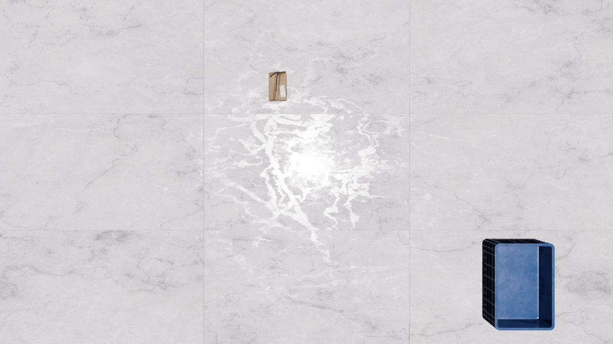

# Metron AI: ArDaGen Datasets

Datasets generated by [Metron AI: ArDaGen](https://github.com/OndrejSzekely/metron_ai_ardagen) project.

## Dataset Codename Convention

Dataset names are encoded in following convention:

<h3 style="text-align: center">
    <span style="color:#F9895C;">U-<i>&ltuse_case_name&gt</i></span><span style="color:#65BCD8;">|<i>&ltdataset_name&gt</i>-</span><span style="color:#F8D643;">
    C<i>dd</i></span><span style="color:#545A5E;">F<i>dd</i></span><span style="color:#ef5350;">L<i>dd</i></span><span style="color:#8bc34a;">P<i>dd</i></span> <!--markdownlint-disable MD013-->
</h3>

:::{list-table} Dataset Codename Convention Explanation Table
:widths: auto
:align: center
:header-rows: 0

*   <p style="color:#F9895C;">U-<i><use_case_name></i></p> <!-- markdownlint-disable MD004 MD007 MD030-->
    Denotes use case/project name for which the datasets are generated. *<use_case_name>* is arbitrary string of any
    characters number.
*   <p style="color:#65BCD8;">|<i><dataset_name></i>-</p>
    Denotes dataset name. *<dataset_name>* is arbitrary string of any
    characters number.
*   <p style="color:#F8D643;">C<i>dd</i></p>
    Denotes dataset complexity level from the use case's task perspective. Therefore, there is no common definition,
    but it is use case specific. *dd* denotes **required** number of digits. *00* denotes the lowest complexity.
*   <p style="color:#545A5E;">F<i>dd</i></p>
    Denotes dataset sensors fidelity -e.g. camera sensor rendering quality or LiDAR physics laws correctness.
    There is no common definition, it is use case specific. *dd* denotes **required** number of digits.
    *00* denotes the lowest fidelity.
*   <p style="color:#ef5350;">L<i>dd</i></p>
    Denotes used labels setup. It can be specific sensor set or different output format.
    There is no common definition, it is use case specific. *dd* denotes **required** number of digits.
*   <p style="color:#8bc34a;">P<i>dd</i></p>
    Denotes dataset part. *dd* denotes **required** number of digits.

:::

Dataset name complying all rules could be **U-box|singleCam-C00F00L01P01**.

## Scenarios Database

*Catalogue* contains *Scenarios* definitions for *Metron AI: ArDaGen*, which can be used to regenerate the datasets.
This guarantees the traceability of datasets and their specification.

The naming convention of *Scenario* files is supposed to follow
[datasets naming convention](#datasets-codename-convention).

*Scenarios* are located in `ardagen_scenarios` folder.

## Datasets Use

Run *Catalogue* container and mount `<ISAAC_SIM_PATH>/metron_ai_ardagen/conf/scenarios/` path to the container. Go
into the mounted folder inside the container and run:

```shell
dvc get https://github.com/OndrejSzekely/metron_ai_catalogue datasets/ardagen/<ARDAGEN_DATASET_NAME>
```

## Datasets Overview

### *U-dev*

This usecase is supposed to be used during AI development, i.e. unit tests, overfitting debug trainings, etc...

#### *U-dev|ardagen_mocked_env-C00F00L00P00*

The most simplistic dataset with two objects - paper box and blue container. Their location and ground material are randomized. Lighting is consistent.

|     |     |
| --- | --- |
| **Dataset size** | 10 image samples |
| **ArDaGen commit sha** | [`edde3ff89aca39443af27c9ae8e0330c17395173`](https://github.com/OndrejSzekely/metron_ai_ardagen/commit/edde3ff89aca39443af27c9ae8e0330c17395173) |
| **Catalogue path** | `datasets/ardagen/development/U-dev\|ardagen_mocked_env-C00F00L00P00` |
| **Scenario YAML** | `ardagen_scenarios/U-dev\|ardagen_mocked_env-C00F00L00P00.yaml` |


